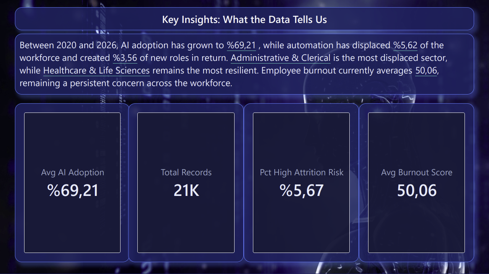
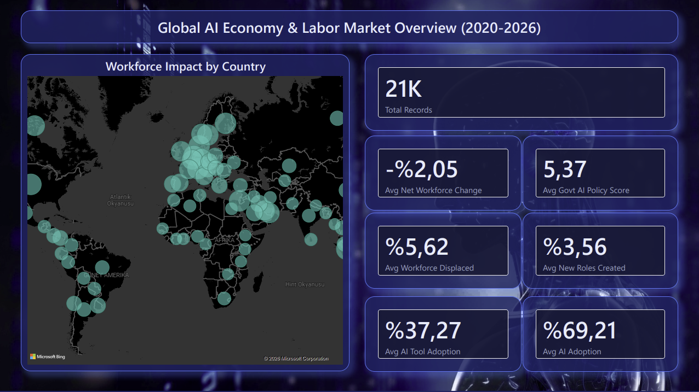
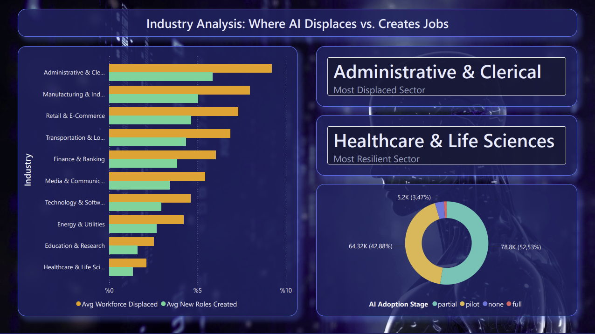
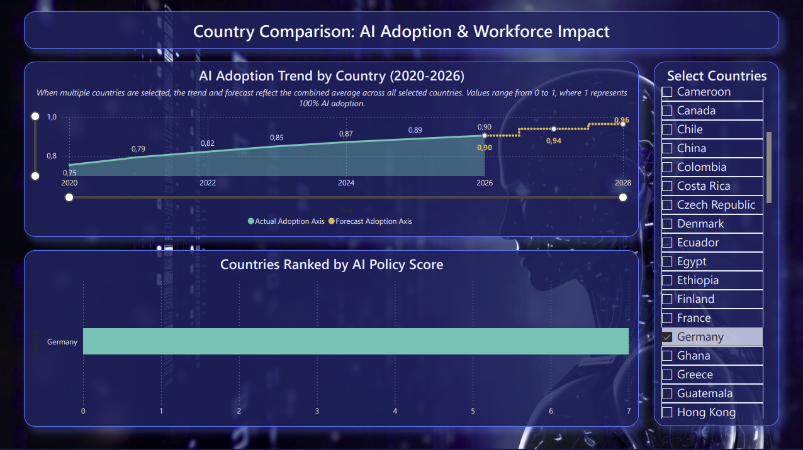
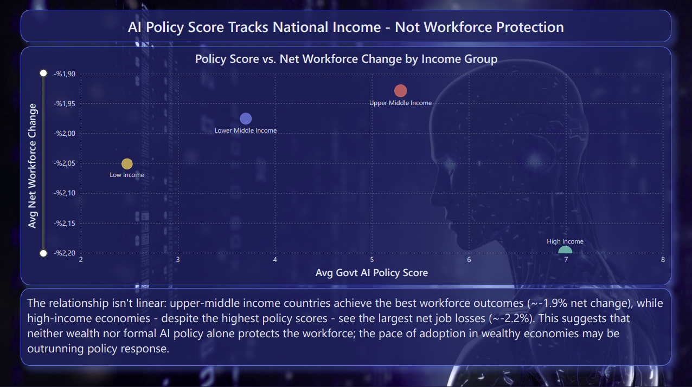
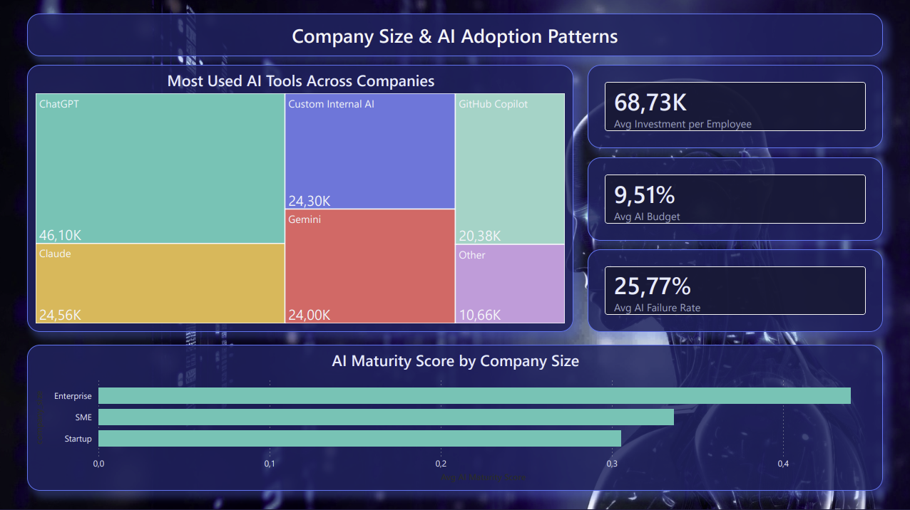
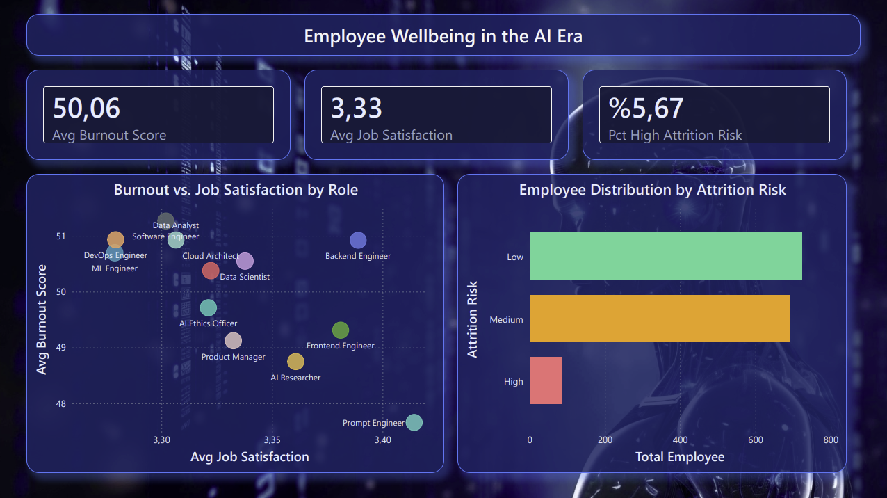
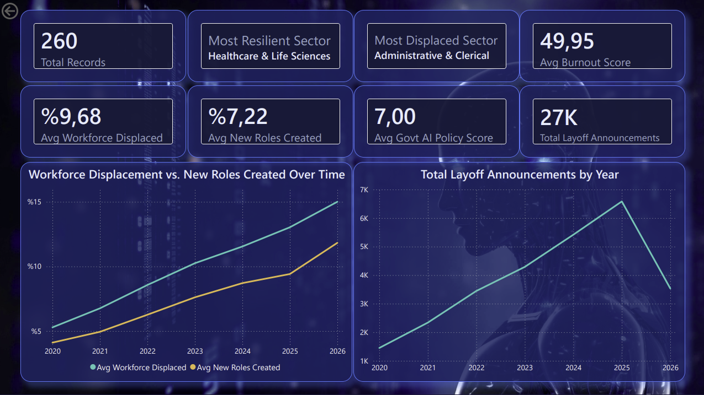

# Global AI Economy & Labor Market Dashboard

An interactive Power BI dashboard analyzing how AI adoption is reshaping the global workforce (2020–2026), built on ~173,000 rows across three synthetic datasets (workforce displacement, company AI adoption, employee burnout/attrition) spanning 80 countries.

> To explore the report, download the `.pbix` file from the `powerbi/` folder and open it in [Power BI Desktop](https://www.microsoft.com/en-us/power-platform/products/power-bi/downloads) (free).

---

## What this project covers

### Key Insights
An executive summary page using Power BI's Smart Narrative, with live values embedded directly in the sentences that update as filters change.

### Overview
Global KPIs and a country-level map of workforce impact across 80 countries, 2020–2026.

### Industry Analysis
Which sectors are most displaced vs. most resilient to AI-driven change, plus company AI adoption stage distribution.

### Country Comparison
AI adoption trends by country (2020–2026) with a linear-regression-based 2027–2028 forecast, built entirely in DAX after Power BI's native Forecast feature turned out to be incompatible with this data structure.

### Policy Impact Analysis
A scatter plot testing whether government AI policy scores actually correlate with better workforce outcomes. They don't — at least not linearly: upper-middle-income countries have the best outcomes, while high-income countries, despite the highest policy scores, see the largest net job losses.

### Company Adoption
AI tool usage, budget allocation, and adoption maturity broken down by company size.

### Employee Wellbeing
Burnout, job satisfaction, and attrition risk by job role.

### Country Detail (drill-through)
A dedicated detail page, accessible by right-clicking any country on the Overview map, that dynamically re-filters every KPI and chart to the selected country.

## Technical approach

- **Data model:** star schema with a shared `Country` and `YearTable` dimension connecting three fact tables at different grains.
- **DAX:** from simple aggregations to `TOPN`/`SUMMARIZE` for dynamic "most affected sector" measures, and a hand-written linear regression (slope/intercept from first principles) for the adoption forecast — built after Power BI's native Forecast feature didn't fit this data structure.
- **Custom Power BI theme** and background imagery for a distinct visual identity.

## Data quality issues found and fixed

This dataset was intentionally messy in places, and part of the value of this project was finding and fixing real data issues rather than accepting numbers at face value:

1. **Locale/decimal corruption on import.** Several decimal columns across all three source tables (adoption rates, displacement percentages, policy scores) were silently imported with their decimal points stripped by a locale mismatch, inflating values by 10–1000x (e.g., an adoption index of `0.69` displaying as `627.52`). Fixed by re-importing affected columns with explicit locale settings in Power Query, table by table.
2. **A silently broken relationship.** After a data refresh, two "year" key columns were auto-detected as text instead of whole numbers, which silently dropped the relationships between the date dimension and two fact tables — with no visible error, since no measure directly aggregated those columns. This only surfaced as nonsensical results in a forecasting measure that depended on year-based filtering, and required tracing the issue back to the model's relationship layer rather than the DAX itself.
3. **Formatting bugs that understated real percentages by 100x** (e.g., a workforce displacement rate of 5.6% displaying as "0.06%") due to a custom format string applied to values that still needed multiplying by 100.

## Tools

Power BI Desktop (Power Query, DAX, data modeling), SQL for independent data validation.
